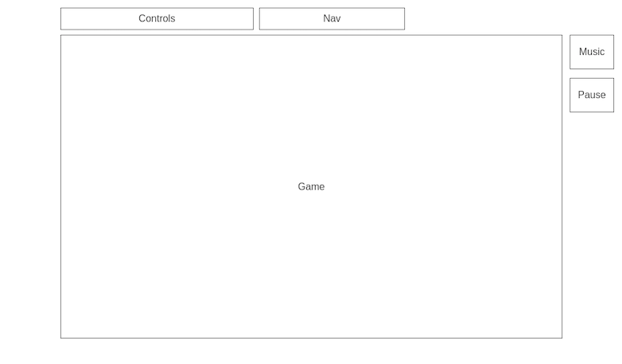

# GenericSidescroller

## Background
* Generic Sidescroller is a game where the player controls a character that can move left, right, and attack.
* The goal is to reach the end of the level while eliminating as many enemies as possible.
* You play as a swordsman Old Richard that was imprisoned by Demon Lord Anthony. After a decade of imprisonment, Old Richard escaped and now his sole mission is to slay Anthony with his big sword.

## Functionality & MVPs
In Generic Sidescroller, users will be able to:
* Move player character left, right, and be able to jump.
* Attack enemy character to accumulate points.
* Dodge roll to avoid enemy attacks (pending).
* Pause the game.
* Stop the music from playing.

In addition, this project will include:
An About modal that will display the controls.
A production README

## Wireframe

## Technologies, Libraries, APIs
This project will be implemented with the following technologies:
* Javascript
* CSS
* Canvas API

## Implementation Timeline
* Friday Afternoon & Weekend\
Making character, one enemy and background to appear. Making player character capable of moving when keystroke is pressed.
* Monday\
Complete player character attacking animations. Make attacks capable of "hitting" enemy character. Allow points to be accumulated after eliminating enemy.
* Tuesday\
Complete enemy character animations and enemy A.I. 
* Wednesday\
Complete UI and additional features.
* Thursday Morning\
Polish.

